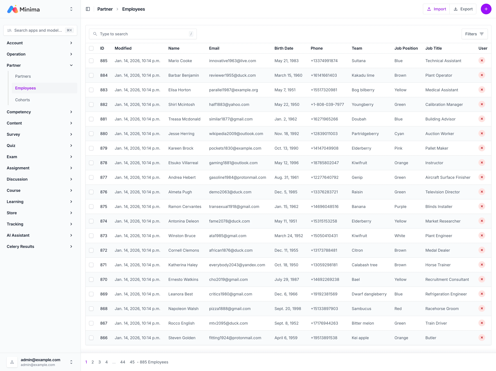

# Partner

!!! note "파트너 학습그룹, 카탈로그"

    Minima LMS에 파트너를 추가할 수 있습니다.
    파트너에는 직원이 있고 직원들은 학습그룹에 등록이 됩니다.
    학습그룹은 카탈로그를 가질 수 있습니다.
    파트너의 직원은 학습그룹이 가지는 카탈로그에 들어 있는
    콘텐츠를 자유롭게 이용할 수 있습니다.
    카탈로그는 '학습(Learning)' 앱에서 관리됩니다.

 

