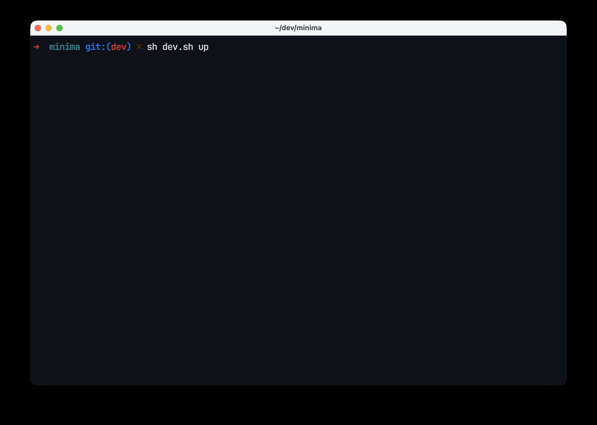
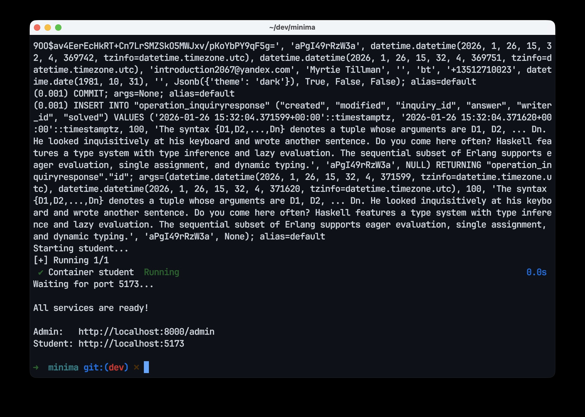

# Installation

## Requirements

- Docker

## Quick Start

```bash
git clone https://github.com/cobel1024/minima && cd minima
sh dev.sh up
```



Automatically downloads images, builds, starts services, and creates demo data.
First installation takes about 10 minutes, reinstallation takes about 3 minutes.



Ready to use after installation.

## Demo Accounts

**Student Interface**: [http://localhost:5173](http://localhost:5173)
Email: `admin@example.com` / Password: `1111`

**Admin Panel**: [http://localhost:8000/admin/](http://localhost:8000/admin/)
Email: `admin@example.com` / Password: `1111`

## Infrastructure

- **API Docs**: [http://localhost:8000/api/docs](http://localhost:8000/api/docs)
- **Mailpit** (Email): [http://localhost:8025](http://localhost:8025)
- **MinIO** (Storage): [http://localhost:9001](http://localhost:9001)
  User: `minima` / Password: `minima.dev`
- **OpenSearch**: [http://localhost:9200](http://localhost:9200)

## Clean Up

```bash
sh dev.sh clean
```

Removes services and data. Docker images remain.

## Logs

```bash
sh dev.sh logs -f --tail 100
```
