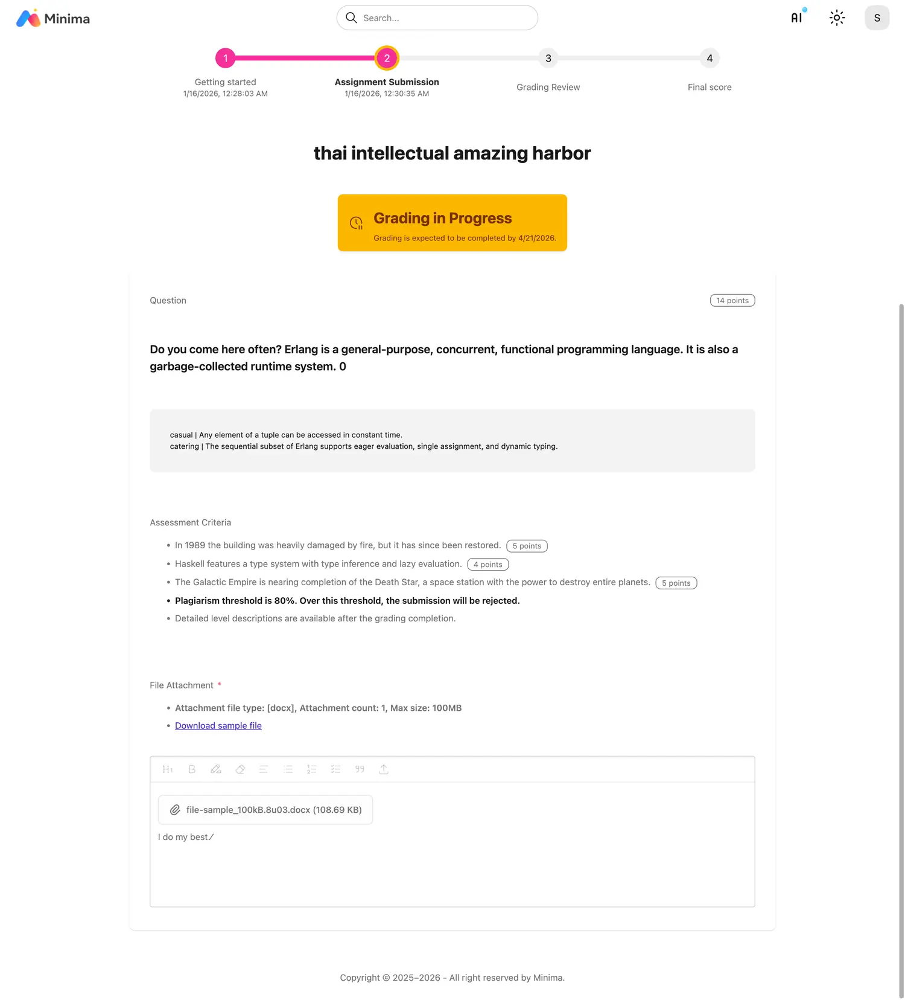
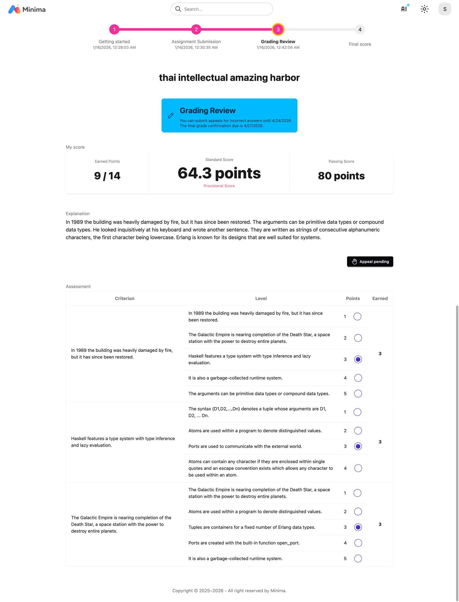
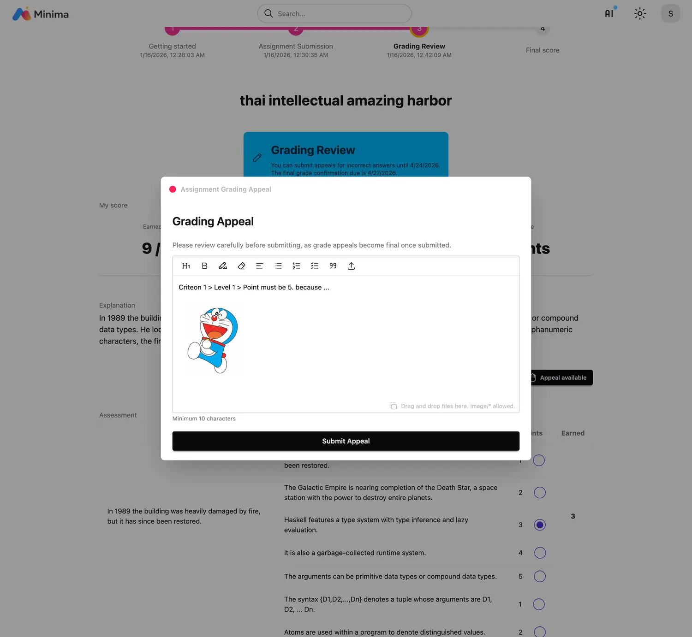

# Assignment

## Step 1. Getting Started

- 준수사항에 동의를 하고 인증을 한 후에 과제를 시작합니다.

## Step 2. Submitting Assignment

- 기간 내에 작성한 과제를 제출합니다.

- 채점 기간 동안 채점이 진행됩니다.

!!! failure "사전 모사답안 검사"

    과제를 제출할 때 사전 모사답안 검사가 진행됩니다.
    과제에 설정된 모사답안 기준에 해당하면 과제를 제출할 수 없습니다.

    

## Step 3. Grading Review

- 루브릭으로 채점이 완료됩니다. 채점이 완료되면 성적이 공개되고 성적 이의 기간이 진행됩니다.

- 채점 이의 기간 내에 이의 신청을 합니다.

## Step 4. Final Grade

- 채점 이의에 따라 필요한 경우 재채점을 하고 점수를 확정합니다.

 

!!! note "Badge 서비스"

    이 성취는 뱃지 서비스와 연결될 수 있습니다.
