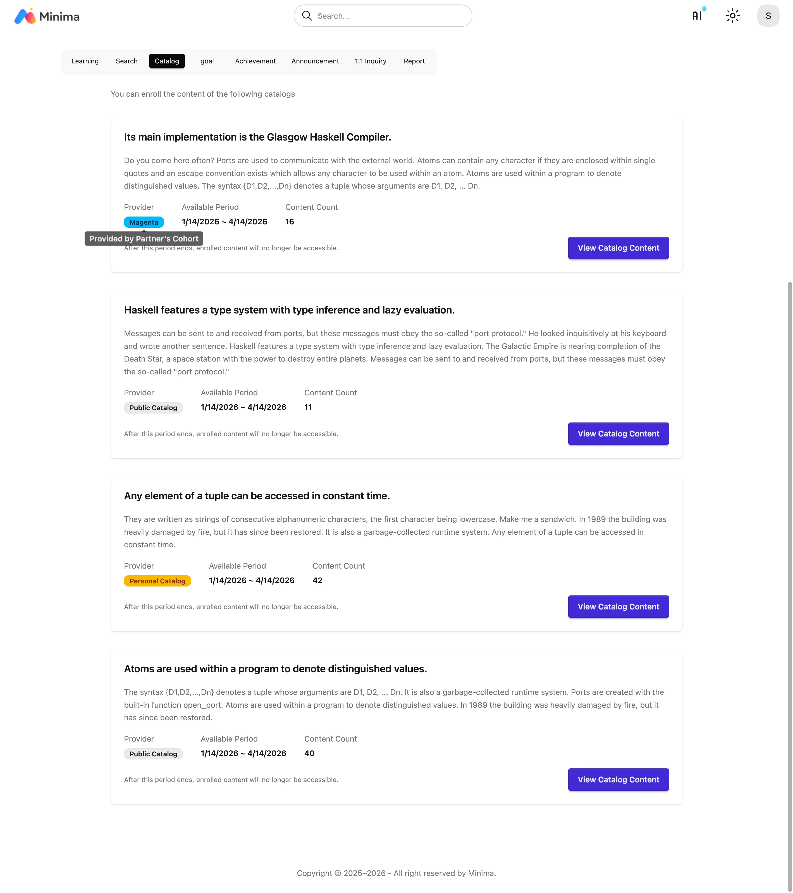
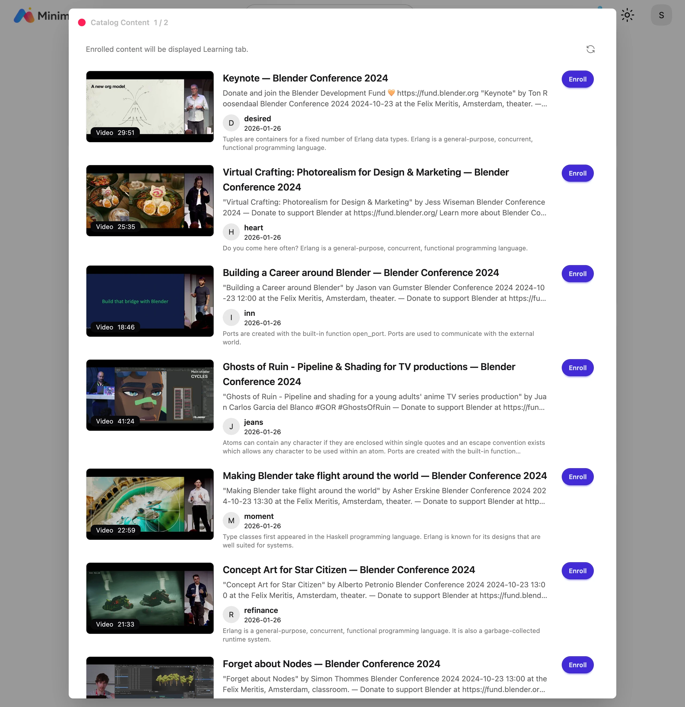

# Catalog

- There are public catalogs, personal catalogs, and learning group catalogs.
- Public catalogs are available to all users, personal catalogs are provided only to individual learners, and learning group catalogs are provided only to learners in the learning group.

- Select a catalog and register content directly.

!!! note "My Learning Groups"

    Learning group information cannot be entered or edited by learners.
    It is managed by the partner's administrator.
    You can view your learning group information on the profile page.

    
