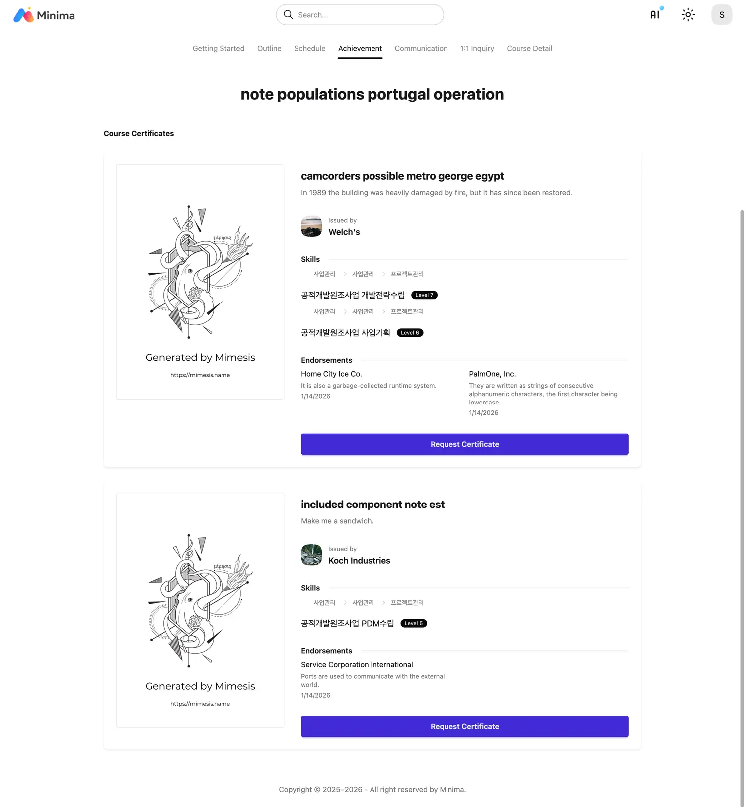
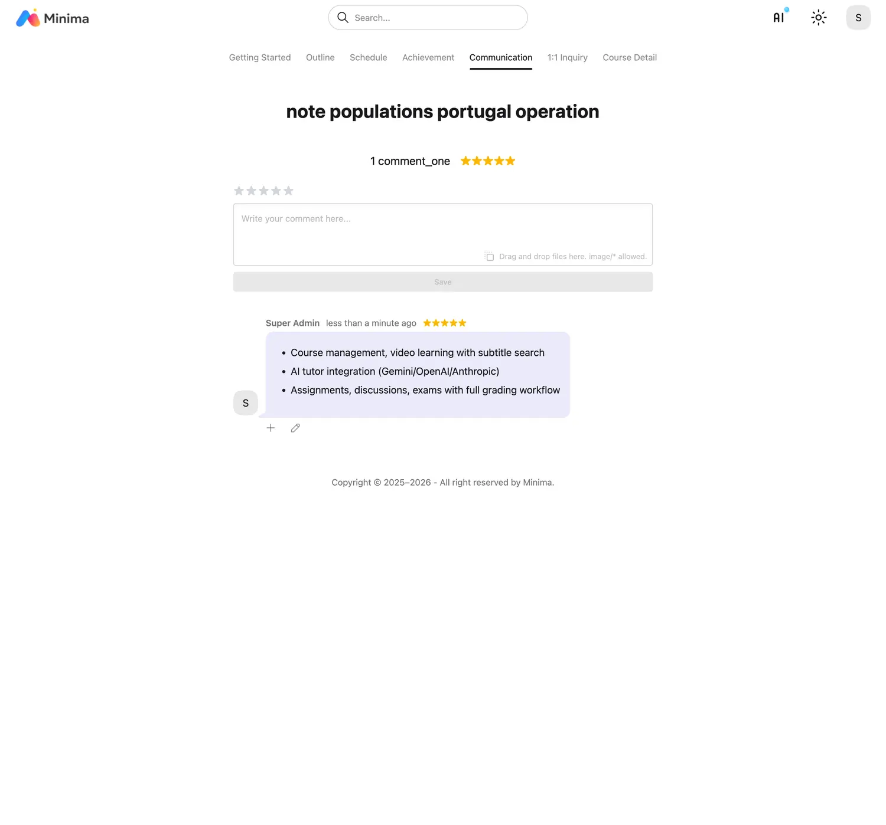
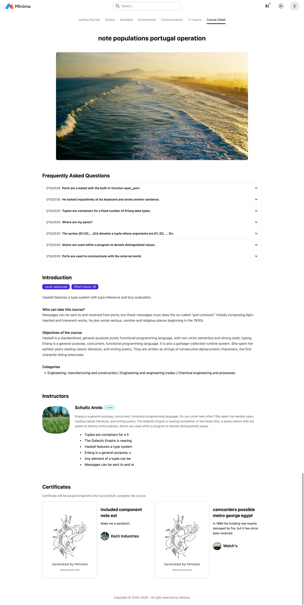

# Course

!!! note "Micro Learning"

    Minima LMS allows learning objects to be used directly 
    or included in a course for learning. It is designed to reuse 
    a single learning object in multiple ways.

!!! warning "Learning Record Tracking"

    When reusing the same learning object in multiple ways, there is a problem 
    of whether to view the learning record as a single record or as a separate 
    record for each location. Minima LMS stores and tracks learning records 
    separately for each location, completely isolating them.

 

- Agree to the compliance requirements and authenticate before starting the course.

- Proceed with discussions, assignments, exams, surveys, and lecture learning according to the set schedule.

- You can check the schedule on the calendar.

- You can apply for a certificate when you pass the completion criteria and grades are finalized.

- Certificates are issued immediately upon application.

- You can leave a course evaluation.

- You can proceed with 1:1 Q&A for each course.

- You can check the detailed information of the course.

