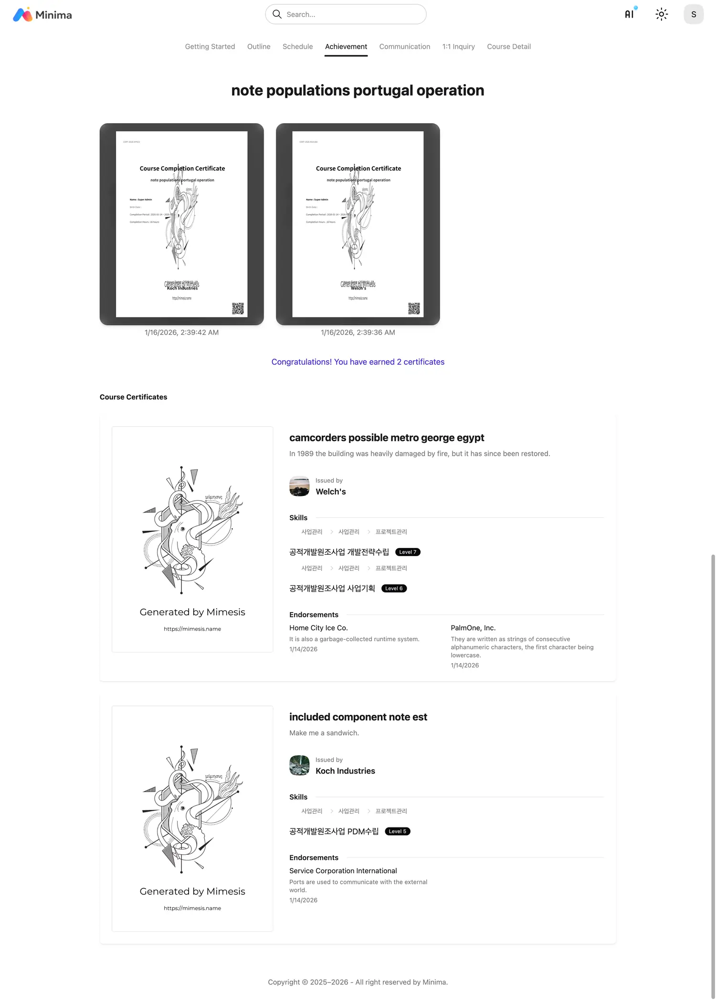

# Course

!!! note "Micro Learning"

    Minima LMS allows you to use learning objects directly
    or include them in courses for learning. One learning object
    is designed to be reused in multiple ways.

!!! warning "Learning Progress Tracking"

    When reusing the same learning object in multiple ways, there's a question
    whether to track learning progress as a single record or separate records per location.
    Minima LMS stores and tracks learning records separately per location, fully isolating them.

 

- Accept the terms and authenticate before starting the course.

- Participate in discussions, assignments, exams, surveys, and lectures according to the schedule.

- Check the schedule on the calendar.

- Once you pass the completion criteria and grades are finalized, you can apply for a certificate.

- Certificate is issued immediately upon application.

- You can leave a course evaluation.

- 1:1 Q&A is available for each course.

- Check detailed course information.

