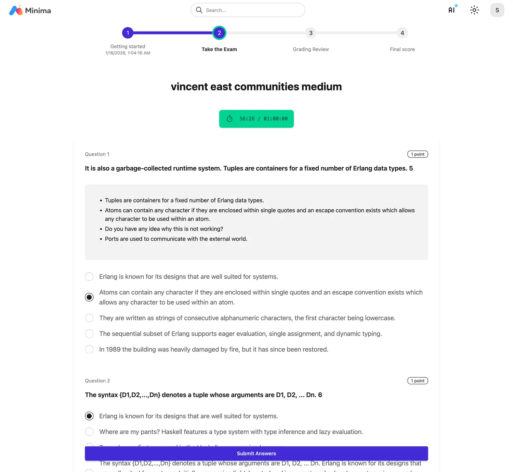
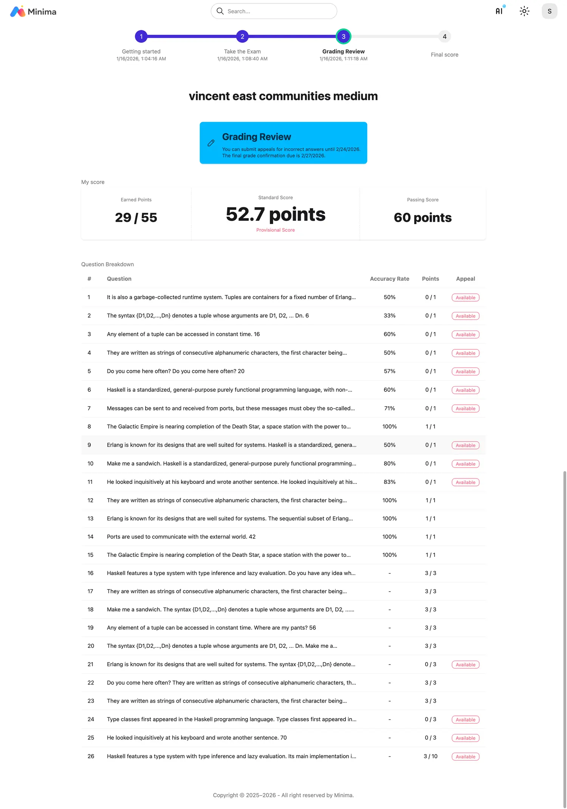

# Exam

## Step 1 Getting Started

- Agree to the compliance requirements and authenticate before starting the exam.

## Step 2. Taking The Exam

- Submit your answers within the exam time.

- Grading is in progress during the grading period.

## Step 3. Grading Review

- Once grading is complete, grades are published and the grade appeal period begins.

- File an appeal during the grade appeal period.

## Step 4. Final Grade

- Re-grade if necessary based on the grade appeal and finalize the score.

 

!!! note "Badge Service"

    This achievement can be linked to the badge service.
