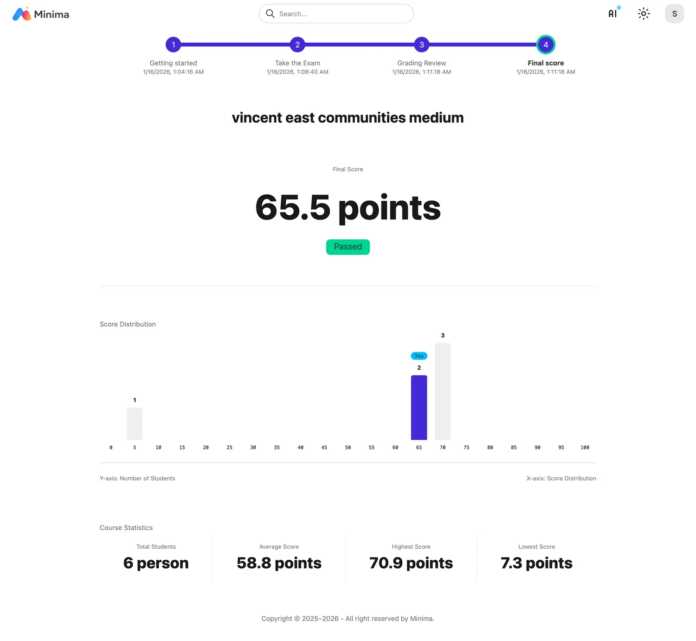

# Exam

## Step 1 Getting Started

- 준수사항에 동의를 하고 인증을 한 후에 시험을 시작합니다.

## Step 2. Taking The Exam

- 시험 시간 내에 답안을 제출합니다.

- 채점 기간 동안 채점이 진행됩니다.

## Step 3. Grading Review

- 채점이 완료되면 성적이 공개되고 성적 이의 기간이 진행됩니다.

- 성적 이의 기간 동안 이의 신청을 합니다.

## Step 4. Final Grade

- 성적 이의에 따라 필요한 경우 재채점을 하고 점수를 확정합니다.

 

!!! note "Badge 서비스"

이 성취는 뱃지 서비스와 연결될 수 있습니다.
