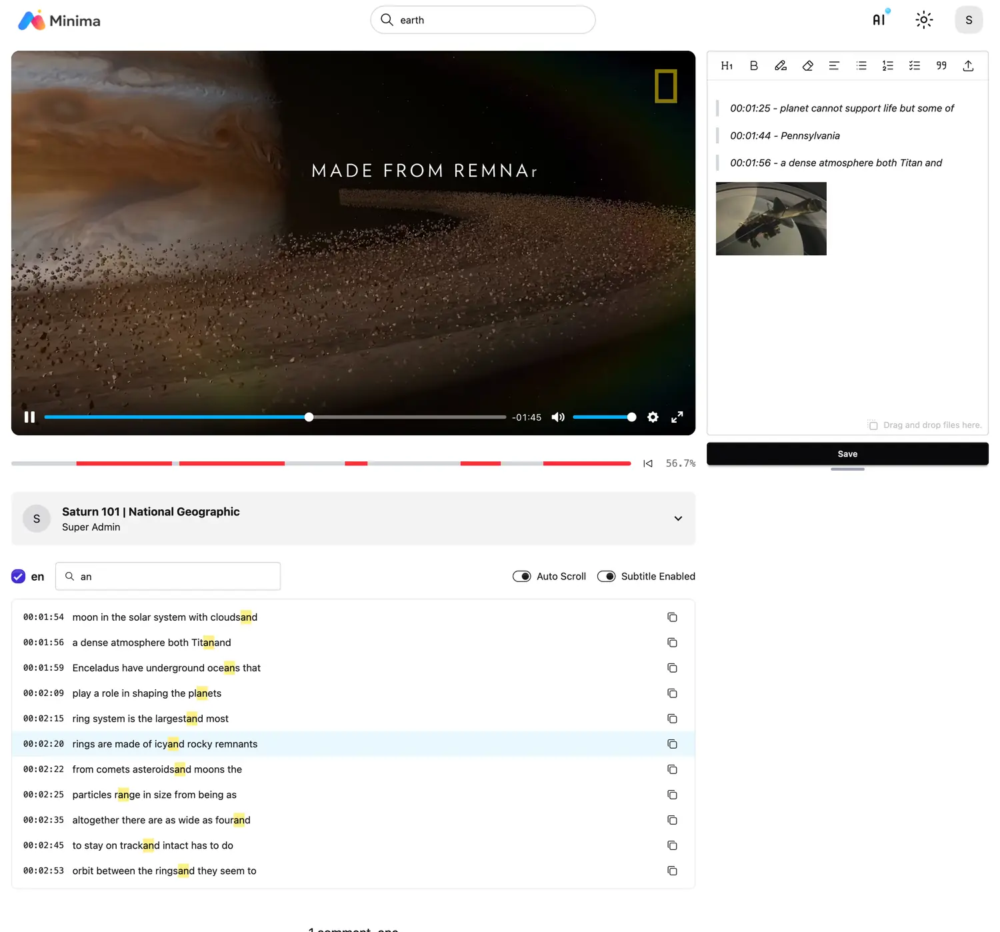

# Video

!!! note "Various Source Playback"

    Videos use the Plyr player.
    It supports various sources such as video URLs like YouTube and Vimeo, 
    as well as self-hosted content.

!!! note "Viewing Time Tracking"

    Viewing time is tracked and saved by the second at the actual playback position, 
    and progress is calculated only by the actual playback position.

    

 

