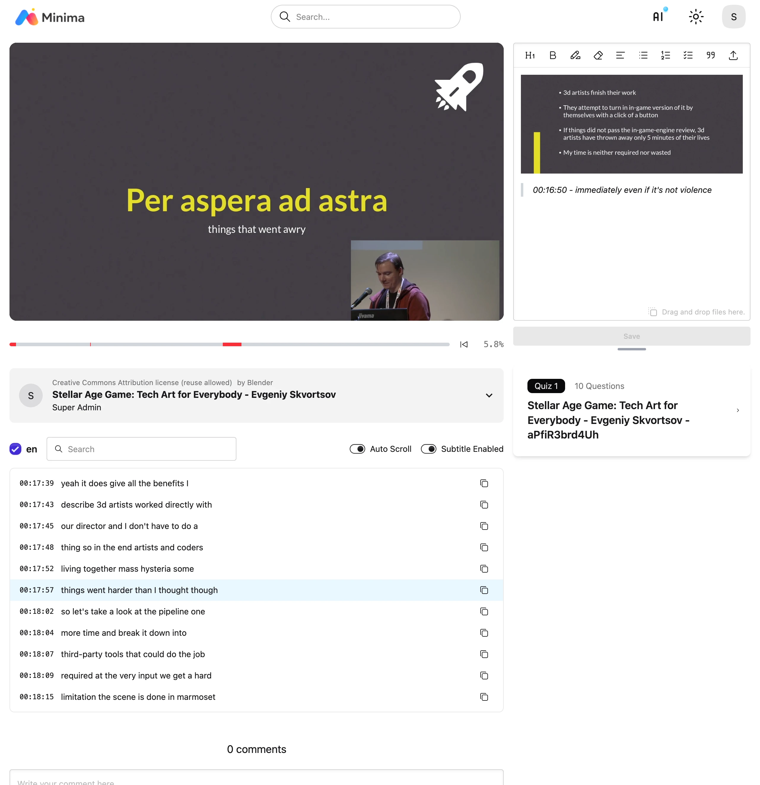

# Video

!!! note "다양한 원본 재생"

    동영상은 Plyr 플레이어를 사용합니다.
    자체 호스팅 동영상 뿐만 아니라 YouTube, Vimeo 같은 외부 동영상을 학습 원본으로 사용할 수 있습니다.

!!! note "시청 시간 추적"

    시청 시간을 초단위로 실제 재생한 위치를 추적해서 저장하고,
    실제 재생 위치만으로 진행율을 계산합니다.

    

- 동영상 학습중에 내용 검색, 노트 작성, 퀴즈 풀기를 할 수 있습니다.

